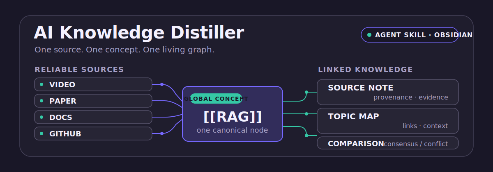
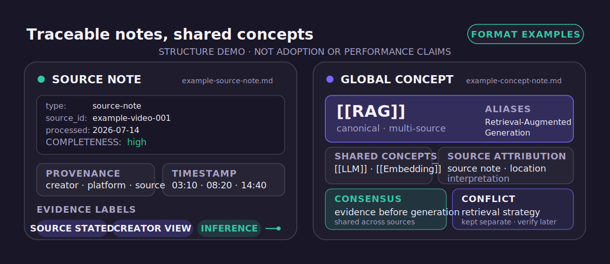
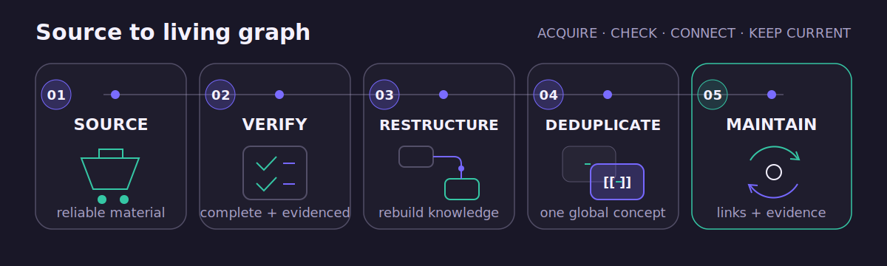

<p align="center">
  
</p>

[中文](README.md) | [English](README_EN.md)

Turn reliable AI sources into a traceable, reusable, maintainable Obsidian knowledge network while preserving each source's meaning and continuously updating shared knowledge.

## Proof starts with the format

<p align="center">
  
</p>

[View the source-note format example](examples/example-source-note.md) · [View the global concept-note format example](examples/example-concept-note.md)

Both examples use fictional source material to demonstrate format and behavior; they are not production results. Reliable material first becomes a source note with completeness, evidence labels, and location details, then updates shared concepts, topics, comparisons, and knowledge maps instead of copying knowledge for each creator.

## What makes it different

- The source layer preserves who said what, whether the material is complete, and where the evidence appears; the knowledge layer holds reusable global structures.
- Different explanations of one concept update one canonical note while keeping source-specific consensus, differences, opinions, and freshness visible.
- New material enters an existing Vault incrementally: inspect the current state first, then update relevant notes, indexes, and links.

## How it works

<p align="center">
  
</p>

1. **SOURCE**: Prefer official transcripts, original articles or papers, official documentation, and repository code.
2. **VERIFY**: Record obtained and missing material, completeness, source locations, and unresolved claims.
3. **RESTRUCTURE**: Rebuild the question, audience, argument, examples, and conclusion instead of compressing a transcript line by line.
4. **DEDUPLICATE**: Reuse canonical concepts instead of creating knowledge silos by creator, language, or abbreviation.
5. **MAINTAIN**: Repair links, refresh maps and summaries, and record conflicts, gaps, and learning order.

## Quick start

### Repository-level Skill

The shortest path is to clone the repository. The Skill lives at `.agents/skills/ai-knowledge-distiller`, where Codex can discover it while working in the repository.

```powershell
git clone https://github.com/Hi-SU0/ai-knowledge-distiller-skill.git
```

You can also copy only `.agents/skills/ai-knowledge-distiller` to the same path in an existing project.

### User-level Skill

Copy the entire `.agents/skills/ai-knowledge-distiller` directory to:

- Windows: `$HOME\.codex\skills\ai-knowledge-distiller`
- macOS / Linux: `~/.codex/skills/ai-knowledge-distiller`

Open a new Codex task after copying. User-level locations can vary by Codex version, so consult the current product documentation when needed.

### First invocation

```text
Use $ai-knowledge-distiller to distill this official AI Agent transcript into my Obsidian vault: preserve source evidence, and update existing concept, topic, and comparison notes instead of creating duplicates.
```

## Safety by design

- **Source completeness**: Record what was obtained and what is missing. When material is incomplete, process only reliably supported content and never fill in unseen source text.
- **Evidence and traceability**: Separate direct source statements, reasonable inferences, creator opinions, external supplements, unverified claims, and potentially stale claims; retain links, dates, chapters, pages, or timestamps when available.
- **Automatic-transcript safety**: Treat user-supplied ASR or automatic transcripts only as auxiliary evidence; cross-check terminology against source pages and authoritative references, preserve uncertainty when correction is unreliable, and never quote corrupted text as exact speech.
- **Global alias scanning**: Before creating a concept, check Chinese and English names, abbreviations, spelling variants, and aliases; update the canonical note when the meaning matches.
- **Human-edit protection**: Read existing notes first, preserve valid human content, and merge incrementally; never overwrite or delete without explicit authorization.
- **Small samples and five-source maintenance**: Validate a small representative sample before batch work. After every five sources, maintain duplicates, links, maps, summaries, conflicts, gaps, and learning order.

## Limits and fit

### Good-fit tasks

- Distill reliable AI video transcripts, articles, courses, podcast transcripts, papers, official documentation, or repositories.
- Create or update source notes, atomic concepts, topic summaries, viewpoint comparisons, creator indexes, and knowledge maps.
- Audit duplicate concepts, stale claims, missing provenance, and broken wikilinks.

It is not intended for ordinary note formatting that does not require AI knowledge distillation or provenance management, and it does not bypass platform restrictions, download protected media, or perform bulk crawling.

### Current v0.1 limits

`v0.1` is an instruction-driven Skill:

- It does not automatically download Bilibili or YouTube media.
- It does not perform automatic speech recognition (ASR).
- It does not provide bulk transcript extraction or Vault-maintenance scripts.
- It must not fabricate content when subtitles or primary material are unavailable; only reliably verifiable material may be processed.

## Repository guide

<details>
<summary>View the compact layout and key documents</summary>

```text
ai-knowledge-distiller-skill/
├─ .agents/skills/ai-knowledge-distiller/
│  ├─ SKILL.md
│  ├─ references/
│  └─ assets/obsidian-templates/
├─ assets/readme/
├─ examples/
├─ tests/skill-scenarios.md
├─ README.md
└─ README_EN.md
```

- [Skill behavior](.agents/skills/ai-knowledge-distiller/SKILL.md)
- [Vault structure, naming, and migration rules](.agents/skills/ai-knowledge-distiller/references/vault-structure.md)
- [Source-note example](examples/example-source-note.md) and [global concept-note example](examples/example-concept-note.md)
- [Obsidian templates directory](.agents/skills/ai-knowledge-distiller/assets/obsidian-templates/)
- [Scenario tests](tests/skill-scenarios.md)

</details>

## Roadmap

- Non-destructive Vault inventory and maintenance reports.
- Importers for user-provided or officially exported transcripts.
- Concept-alias, duplicate-candidate, and wikilink checkers.
- Frontmatter, source-completeness, and five-source maintenance validators.

Future automation should still protect human edits, report candidate changes by default, and log every move, merge, or deletion.

## License

[MIT License](LICENSE)
